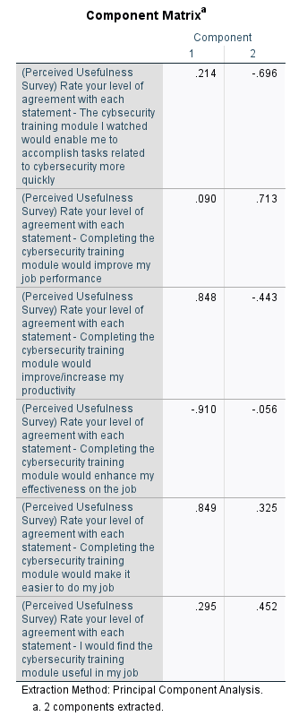

# Research Practicum 2023 – Research Plan

> * Group Name: We've Been Trying To Reach You About Your Car's Extended Warranty
> * Group participants names: James Henderson; Patricia Montoya; Maxwell Stolarenko
> * Project Title: Improving Cybersecurity Culture in the Workplace: A Study of Training Practices and Perceptions

## General Introduction

  

As more businesses and governments adopt advancing information and communication technologies into their infrastructure, the need for proper security training becomes increasingly more important. All employees working adjacent to these technologies must be made aware how their actions can affect how secure a system truly is. Cybersecurity is described as the technologies and practices to protect people and data from an attack through unauthorized access. It’s important for any individual who interacts with these networked technologies to be made aware how it can be used against them or give unauthorized access to attackers. Cybersecurity training can be effective by increasing the awareness of the security risks and teaching individuals how to navigate these risk to protect themselves and the organization from cyber threats. The effectiveness of training can depend on the relevance of the training, the frequency of training, and of course the quality of the training program. 

In 2020, Phishing and Fraud Report discovered a 220% increase in phishing attacks as the opportunities to commit these attacks intensified. These attacks were not just against large business but against anyone that can stumble onto a fake website or fall victim to brand impersonation through social media or email. A banking institution that same year fell victim to a cyber attack where employees divulged login credentials allowing criminals to gain access to sensitive customer information. A glaring issue was revealed later that many employees didn’t properly complete training or dismissed the training as something less than critical. Employees should be properly engaged with cybersecurity training programs with an understanding that carries the importance of why this training is so critical to not only the safety of the company, but to their customer and user base as well. 

Phishing attacks have remained a persistent threat to governments and businesses since the wide adoption of the internet in the early 90s, albeit few people had access to it but the opportunity existed to receive fraudulent emails that attempted to trick users into providing sensitive information. As the attackers use increasingly sophisticated tactics to trick unsuspecting employees into disclosing sensitive information, more organizations invest into training programs that can prevent these attacks from occurring. Cybersecurity training methods to prevent phishing lack proper standardization and their effectiveness remains unclear. Our motivation is to gain insight into which factors contribute to a successful cybersecurity training program with regard to phishing attacks. Our focus will be on the relationship between the perceived ease of use and perceived usefulness of the training methods used to prepare employees for recognizing and addressing cyber threats. 

As demonstrated by the increase in phishing attacks, cyber threats are becoming more sophisticated and pervasive, and organizations must take proactive measures to educate their employees on the best practices for identifying, preventing, and responding to these attacks. There is a need for standardized training methods that can be used across different industries and with different learning styles depending on the trainee. In this study, we aim to contribute to the existing knowledge by investigating the relationship between the perceived ease of use and perceived usefulness of cybersecurity training methods in preparing employees to recognize and respond to cyber threats. Our research will provide insights that can help identify aspects of cybersecurity training programs that influence ease of use, perceptions of usefulness, and which aspects of the training influence an employees’ attitudes and behaviors.

##### This project makes the following contributions:

•	Identify aspects of cybersecurity training programs that influence ease of use

•	Identify challenges a user may face when engaging with phishing training

•	Provide recommendations for improving the design and delivery of training methods to enhance effectiveness

•	Identify which aspects of phishing prevention training influence an employees’ attitudes and behaviors

## Related Work

Cybersecurity refers to the practice of protecting computer systems and networks from unauthorized access that can lead to theft, damage, and other forms of cyber-attacks. The defense against cyber-attacks starts with training the personnel who engage with any network-connected system.  Cybersecurity training covers a wide spectrum of topics from the principles of information security, cyber threat intelligence for future mitigation, vulnerability management, incident response and the compliance of standards. The intent of cybersecurity training is to improve the knowledge, skills, and awareness of individuals to enhance their ability to detect, prevent, and respond to a cyber threat (de Bruijn, 2017; Paulsen, 2012). Modern cybersecurity training involves different approaches such as simulations, virtual environments, and awareness of best practices with the most common implantation being online training (Leah, 2021). The online-training approach is a cost-effective and flexible method for providing individuals with access to a wide range of videos, reading passages, and interactive modules structured to test a user’s ability to detect and respond to a cyber threat. The flexibility of online training affords a self-paced learning environment that can be accessed from any location. Regular training and assessment can ensure an individual’s skills are meeting a given standard to identify and protect against cyber threats.

Cybersecurity is an umbrella term encompassing a wide range of terms surrounding attacks and the means to prevent them, one of which being phishing attacks. A phishing attack is a form of social engineering online where a malicious agent attempts to steal the personal information of users while acting under the guise of an official group or company. The term “phishing” is still a broad term that varies in use based on its intended target and the medium it takes place in. The most common form a phishing attack takes on is as an email targeting as many people as it can, known simply as an email phishing attack. This technique sends out vague emails in hopes of getting even a few users to fall for it. Standard email phishing attacks may target every student at a university, for example. In contrast, phishing attacks that target a smaller, more select group of individuals that share similar positions of authority at an organization is known as spear phishing. Spear phishing attempts may target the financial office of a university. Finally there are phishing attacks that target a single individual with high importance, known as whaling. Whaling attempts may target the head administrator of a university. While email phishing is the most prevalent method, phishing can appear across several other mediums, including SMS, phone calls, online games, and search engines (Al-Daeef et al., 2017). 

Due to the significant risks imposed from phishing threats, it is imperative that any user online, whether online for business, education, or personal reasons should be properly equipped and trained for possible cyber risks they may encounter. Al-Daeef et al. (2017) wrote that the most effective defensive strategies against phishing attacks include technical and non-technical preventive strategies in which technical tools and non-technical skills are adopted to reduce falling prey to a potential attack. The technical standalone applications and in-browser extensions exist as tools to automatically detect, warn of, and block access to phishing links but do so with varying levels of effectiveness. As such, the human needs to be trained to accurately detect instances of attempted phishing to avoid uncontested reliance of their technical strategies. To reinforce the effectiveness of individuals’ non-technical prevention skills, training methodologies are often employed to help raise awareness of the existence of phishing attacks and properly recognize the signs to differentiate a phishing email from a real one. Cybersecurity training for phishing emails can be administered in several ways including slide-like presentations, videos/embedded videos, modular training, computer-based simulations, virtual machine environments, classroom teaching, and much more (Jampen et al., 2020). Of particular note are the phishing email demonstrations as these directly pertain to the current study. Unlike other training methods, phishing email evaluations can be sent on a per user basis with varying levels of difficulty depending on the individuals’ past behaviors. This can allow for multiple parameter modifications across each person, including the time between training intervals, the  degree of accuracy of the phishing email versus a real one, the relevancy of the content within the email, and the difficulty of its fraudulent characteristics (Jampen et al., 2020). 

An often overlooked aspect of non-technical prevention of phishing attacks are the attitudes an individual develops for the training strategies or content, or their perceived usefulness of the training. Perceived usefulness is an individual’s subjective opinion of how much they feel a technique or technology is actually beneficial to them, which can play a crucial part in knowledge acquisition and retention (Abbasi et al., 2016). Past research had demonstrated that users who did not perceive tools meant for mitigating phishing threats as useful would fall victim much more likely to real phishing attempts through both emails and websites alike, often ignoring warnings from the system and relying solely on their intuition instead. In contrast, users that did perceive anti-phishing tools to be helpful were much more careful with their actions with each website they visited. These individuals would frequently hesitate to click anything suspicious and would often wait for the assistive tool to inform them if anything they were viewing was malicious or not. (Abbasi et al., 2016). Bouts of intuition reliance over the several different techniques to train and detect phishing attacks showed that users that perceived the usefulness of the protective tools to instead place their trust in their own abilities, often resulting in over-confidence in their likelihood to correctly identify genuine phishing attacks (Jampen et al., 2020). Users with a low perceived usefulness towards a technique or technology may find it more of a hinderance than an aid and may ignore what it says to do or even actively do the opposite. 

The other half to a user’s acceptance towards a training technique beyond their perceived usefulness is their perceived ease of use of the training content itself. Perceived ease of use is an individual’s subjective opinion regarding the difficulty of a cybersecurity training. This perceived ease of use can present itself based on the difficulty of the training content such as how easily identifiable the phishing email is, the difficulty navigating through the training content if the email training is in learning modules, and the general amount of time the user has to divert away to perform the training task. (Reeves et al., 2021). This perceived ease of use can also be the inverse as the lack of difficulty, as the lack of a challenge may not make the training content challenging enough to feel cognitively engaging. A phishing training that is too easy to complete may not only underwhelm the learner, but it may also habituate improper techniques for recognizing phishing emails. (Reeves et al., 2021). People may feel cybersecurity fatigue from both ends of the difficulty spectrum. If the content is too easy they may become dismissive to the need to continue training any further than what they already know as it is no longer challenging enough to retain any useful information. If the training content is too hard then they might develop defeatist attitudes towards the training as they know they will complete the assessment incorrectly and be subject to even further training (Reeves et al., 2021).

While there was extensive research on phishing practices, phishing training, tools to prevent phishing, and perceived usefulness & perceived ease of use with cybersecurity training, there exists no literature that ties all of these concepts together in a presentable form. The perceived usefulness reserach pertained to the use of the technical side of phishing prevention but leaves a desirable gap for the perceived usefulness of non-technical prevention techniques. Similarly, the research on the perceived ease of use was not limited to merely phishing training but rather a multitude of cybersecurity concepts to generate cyber fatigue. With this in mind, this review demonstrates that the examined literature leaves much to uncover for the human side of phishing training by further researching perceived usefulness and perceived ease of use of phishing training specifically.

## Methods

Operational Definitions:

Cybersecurity - Knowledge and awareness of signs and countermeasures against cyber threats, in the context of phishing attacks. 

Training - The education, instruction, or discipline of a person or thing that is being trained.

Phishing - Cyber attack directed at key individuals or large groups by disguising a malicious attack as a reputable organization or entity. 

Perceived Usefulness - A subjective opinion based on a persons understanding of cybersecurity effectiveness.

Perceived Ease of Use - A subjective opinion on the difficulty/lack of difficulty of cybersecurity training.

Industry Professional - A person that works in a corporate office environment. 

Elite Bias - A phenomenon that occurs when researchers fail to gain an understanding of the broader situation by only focusing on the perceptions of certain people of a high status.

Research Design:

In the context of cybersecurity training, a case study can provide valuable insights on the training process and the impact it has on the trainee or organization. We aim to explore the training experiences of a specfic organzation's method for cybersecurity training, examine their methods for delivering this training, and the content that is covered. Through this examination, our case study also aims to identify the quality of the content presented in training, the engagement of the trainees and the extent to which the training can be integrated into an organization's security culture.

Participants:

The participants we are interested in for our study are industry professionals that are currently in the workforce. We are defining an industry professional as an individual who works in a corporate office environment. They would be familiar with cybersecurity trainings but will not have above average awareness of cybersecurity. We are looking at a sample size of at least 10 to 15 paricipants but ideally 30 participants for a greater level of percision to detect smaller effect sizes.

Equipment:

The equipment needed to conduct our study is a tool to create and host they surveys. The tool we have decided to use is Qualtrics since it is easily accessible to us. A laptop with internet access is also required as the tool the participants will use to take the surveys. We will also require access to a cybersecurity training video or examination for post scenario.  

Training Module & Game: https://training.knowbe4.com/learner/index.html#/training/

Qualtrics Survey: https://ucf.qualtrics.com/jfe/form/SV_daqFIfVveCvOcmy

Procedure:

For this study the participants will be acquired using snowball sampling. Each team member will reach out to an individual who fits the participant criteria to run through the study. Those initial participants will then refer 1-2 individuals they believe would be interested in participating in the study. The first step of the experiment the participants will be asked to read and sign an informed consent form followed by a demographic information survey. The demographic survey will help us filter out any participants that do not fit the criteria and those participants can be excluded. As an incentive for participation in the study we will be offering those that participate a $5 gift card.

  

  

Our experiment will start with a 12 minute training video that will introduce the participant on what is phishing, the motivation behind criminals and how they use phishing, and how to avoid falling victim to phishing attempts. Next the participant will be able to apply what they learned to an 8 minute interactive phishing activity that allow them to decide whether or not an email is a phishing attempt. The acitivty will provide a score to the user after the completion of the activity.

 

  

Our data will be obtained through surveys composed of open-ended questions as well as 5-point likert scale questions. We will be using the 5-point likert scale versus a higher likert scale because we want to keep the questions as direct and easy as possible for our participants. As mentioned above our study will begin with demographic questions to help us both with excluding participants that do not fit our sample group criteria as well as to provide us with the potential to find patterns within groups. The questions using the likert scale will be based on the participants perception of usefulness and their perceived ease of use of cybersecurity phishing training.

Data analysis:

Based on our background research, overall feelings toward cybersecurity training lean towards the negative so we anticipate a trend of similar responses for perceived usefulness and perceived ease of use for cybersecurity phishing training. What we expect to achieve from the results of our study is a better understanding of how industry professionals perceive cybersecurity phishing training and lend some insight as to how to improve the experience for the user in the future. 

IV - Content of cybersecurity training 
DV - Perceived Ease of Use and Perceived Usefulness

## Analysis

The aim of this study was to examine industry standards for teaching staff on cybersecurity awareness and identifying fraudulent emails. Specifically, we focused on the training module used by the University of Central Florida, which teaches staff how to detect and address phishing attempts via email. Although many similar training modules exist, little research has been conducted on their effectiveness or staff's perceptions of the online training. To address this gap, we propose a qualitative questionnaire to measure the perceived ease of use and usefulness of the training module. The primary purpose of measuring usability and ease of use is to identify any potential barriers to user adoption and acceptance of the concepts taught in the training. The ultimate goal of this training is to enhance staff skills effectively while being user-friendly. Our questionnaire aims to improve user satisfaction, productivity, and efficiency by identifying areas where improvements can be made to increase ease of use and user acceptance.

#### Cronbach's Alpha

	
 

With the help of a built-in function for Qualtrics to fill in hypothetical data and repeated attempts at self-testing our procedure, we amassed 30 passes of our survey that we began to analyze with SPSS. First was a reliability analysis with Cronbach’s Alpha which we received a score of 0.322 for both Likert scales. This is considered a low score and indicated that the scales we used have low internal consistency. This means the items we used in our perceived usefulness and ease of use scales do not strongly correlate with each other and are not measuring the same underlying construct. We deduced that there are several reasons for this, one of which is that our wording was not clear, and our intended constructs are not accurately portrayed in the scales. Second, and the more likely of the two possibilities was our hypothetical data from Qualtrics or our own attempts causes a skew in the data that didn’t give us accurate experiences if we were to conduct this experiment on our intended participants. 

We want to study how our Cronbach’s Alpha score can be increased, so we wish to refine the wording of the items and consider revising them to make sure they are clear and represent exactly what we are intending to measure. This could involve removing or adding items to increase the variability of our responses that could help improve consistency.

#### Exploratory Factor Analysis

Continuing with the same dataset from our reliability analysis, we ran an exploratory factor analysis on each of the Likert scales in order to better understand how our hypothetical data may influence underlying factors within the perceived usefulness and ease of use scales.

###### Perceived Usefulness

	

The chart above denotes how SPSS extracted the factors using a quality score called an eigenvalue. The components with high eigenvalues are likely to represent significant underlying factors. Traditionally, we want to look for a minimum eigenvalue of at least 1 while anything lower wouldn’t constitute as real trait underlying the component or question. We can look at the scree plot below to visualize the cutoff between strong and weak factors. In the case of perceived usefulness, there is only two strong factors to consider.

	

To the right of the scree plot above is our component matrix for perceived usefulness which shows how individual measures in the scale may correlate with different components. In this case, our components are the strong factors found from our eigenvalues calculated earlier. Positive values show a positive correlation with the factor and negative values show a negative correlation. 

For instance, we see measure 1 and measure 4 to have negative values for factor 1 while measures 2, 5, and 6 have a high positive correlation with factor 1. This tells us that individuals who find the module to be easy to become skilled at also find it flexible to interact with. Since we are using hypothetical data here, we cannot look too deeply into individual factors as they would produce wildly different results when we engage with actual participants we intended to study. What may be of use to us is determining which factors SPSS could be identifying such as the relevance of the training content and the perceived effectiveness of the training in improving the participants knowledge and skills.

###### Perceived Ease of Use

    

As discussed earlier, we are looking for eigenvalues above 1 and with the chart above we see there are 3 factors that may be extracted from our hypothetical responses. Below is our scree plot which shows a much more gradual drop off compared to our earlier scree plot which isn’t typical when determining the number of components to retain in the factor analysis. Since there isn’t a strong drop off, it may suggest there is no clear separation between the components and the factor analysis is not effectively capturing any underlying structure from our data. It could also suggest there are many factors that are all equally important and it may be necessary to choose a smaller cut off value to retain more factors than initially expected.

	

To further refine our scales, we need to do more to understand the underlying factors of perceived usefulness and perceived ease of use. One way to do this is to conduct a confirmatory factor analysis which tests the validity of the factor structure identified in our exploratory analysis after a refinement has been made. Additionally, we should conduct verbal interviews with our participants or use our open-ended questions so we can gain further insight into what influenced their ratings on these scales. This would give us a point of reference for our confirmatory factor analysis that would better refine our Likert scales and develop more specific items that better capture our intended factors.

#### Linear Regression

We conducted a linear regression analysis to examine the relationship between the participants’ demographic characteristics and their responses to both perceived usefulness and perceived ease of use of the cybersecurity training program. In both analyses, the demographics were chosen as the independent variables but more specifically it was their age, education level, employment status, gender, and ethnic background. The dependent variable would be their answer to the final measure in each Likert scale. The tables below show the coefficients for each independent variable, including the beta, standard error, t-value, and significance level. The beta coefficient represents the change in the dependent variable associated with an increase in the independent variable. The standard error represents the amount of variability in the dependent variables. The t-value is a measure of magnetite of the coefficient relative to its standard error, with large values indicating a more significant relationship between the independent and dependent variables.

###### Perceived Usefulness

	

###### Perceived Ease of Use

    

Due to the hypothetical nature of our data, it’s not prudent to study the values too carefully as they do not carry much weight into the final product of our experiment and only serve to shed light on the how we can expect a relationship between demographic characteristics and perceived usefulness / ease of use. This information can be valuable for designing a more effective training program tailored to the needs of specific demographic groups.

#### Open-Ended Question Coding

	

At the end of our survey, we asked open-ended questions to gain further insight into the experiences of our participants as well as give them an opportunity to express anything that wasn’t covered in our Likert scale; we asked 6 questions that were chosen for this purpose. To analyze our expected responses, we will attempt to transcribe and identify common patterns, themes, and concepts. We start this process through the creation of a coding scheme where each theme of a response can be given its own individual category and only one category for each theme.

For example, in question 1: What aspects of the cybersecurity training program did you find the most helpful in terms of ease of use? We can expect response that could fit the theme of “clear instructions”, “intuitive interface”, or “helpful feedback.”

Question 2: What were the biggest challenges you faced while using the cybersecurity training program? Potential themes: difficulties with interface, complex content, lack of clarity, limited resources.

Question 3: In your opinion, what changes could be made to the cybersecurity training program to make it more user-friendly? Potential themes: Simpler terms / language, increase amount of interactive content, better guidance, change in organization / delivery order of concepts.

Question 4: Can you describe a time when you felt particularly frustrated while using the cybersecurity training program? Potential themes: difficulties with interface, lack of feedback, confusing content.

Question 5: How confident do you feel in your ability to use the skills and knowledge learned from the cybersecurity training program in real-world situations? Potential themes: Varying levels of confidence

Question 6: Do you have any suggestions for additional features or resources that could be added to the cybersecurity training program to enhance its usability? Potential themes: Similar to question 3 with an emphasis on user interface, change in content delivery from video to readings, more choices for interactive game, better feedback.

## Conclusion
Through the preliminary testing of our experiment we found revisions that will need to be made to the survey questions based on the score we received from our validation testing. To fix this issue we would lean into our open-ended questions to help guide us into refining the wording for the individual measures of the scale. Getting the scale questions validated would be our primary focus if we proceed with the research. 

Cybersecurity training is an essential component for all organizations across all fields in today's modern age. The protection of an organizations valuable and sensitive information makes it crucial for all workers to be properly trained in the subject to prevent a cybersecurity incident. Though there is significant importance placed on the subject, literature is still reflecting negative user experiences from non-experts when taking these types of training. Through this research proposable we aim to better understand why receivers of cybersecurity training report having negative experiences through analyzing there perceived ease of use and their perceived usefulness of the training.          

## References 

Abbasi, A., Zahedi, F. M., & Chen, Y. (2016, September). Phishing susceptibility: The good, the bad, and the ugly. In 2016 IEEE conference on intelligence and security informatics (ISI) (pp. 169-174). IEEE.

Al-Daeef, M. M., Basir, N., & Saudi, M. M. (2017). Security awareness training: A review. Lecture Notes in Engineering and Computer Science.

A. Reeves, D. Calic, P. Delfababbro (2021). "Get a red-hot poker and open up my eyes, it's so boring": Employee perceptions of cybersecurity training. Volume 106, 2021, 102281, ISSN 0167-4048, https://doi.org/10.1016/j.cose.2021.102281.

C. Paulsen, E. McDuffie, W. Newhouse and P. Toth, "NICE: Creating a Cybersecurity Workforce and Aware Public," in IEEE Security & Privacy, vol. 10, no. 3, pp. 76-79, May-June 2012, doi: 10.1109/MSP.2012.73.

de Bruijn, H., & Janssen, M. (2017). Building cybersecurity awareness: The need for
evidence-based framing strategies. Government Information Quarterly, 34(1), 1–7.

Jampen, D., Gür, G., Sutter, T., & Tellenbach, B. (2020). Don’t click: towards an effective anti-phishing training. A comparative literature review. Human-centric Computing and Information Sciences, 10(1), 1-41.

Leah Zhang-Kennedy and Sonia Chiasson. 2021. A systematic review of multimedia tools for cybersecurity awareness and education. ACM Computing Surveys (CSUR) 54, 1 (2021), 1–39.

Reeves, A., Delfabbro, P., & Calic, D. (2021). Encouraging employee engagement with cybersecurity: How to tackle cyber fatigue. SAGE open, 11(1), 21582440211000049.

