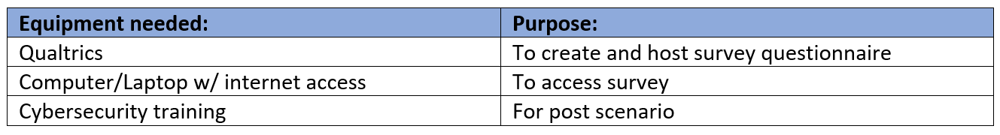

# Research Practicum 2023 – Research Plan

> * Group Name: We've Been Trying To Reach You About Your Car's Extended Warranty
> * Group participants names: James Henderson; Patricia Montoya; Maxwell Stolarenko
> * Project Title: Improving Cybersecurity Culture in the Workplace: A Study of Training Practices and Perceptions

## General Introduction

  

As more businesses and governments adopt advancing information and communication technologies into their infrastructure, the need for proper security training becomes increasingly more important. All employees working adjacent to these technologies must be made aware how their actions can affect how secure a system truly is. Cybersecurity is described as the technologies and practices to protect people and data from an attack through unauthorized access. It’s important for any individual who interacts with these networked technologies to be made aware how it can be used against them or give unauthorized access to attackers. Cybersecurity training can be effective by increasing the awareness of the security risks and teaching individuals how to navigate these risk to protect themselves and the organization from cyber threats. The effectiveness of training can depend on the relevance of the training, the frequency of training, and of course the quality of the training program. 

In 2020, Phishing and Fraud Report discovered a 220% increase in phishing attacks as the opportunities to commit these attacks intensified. These attacks were not just against large business but against anyone that can stumble onto a fake website or fall victim to brand impersonation through social media or email. A banking institution that same year fell victim to a cyber attack where employees divulged login credentials allowing criminals to gain access to sensitive customer information. A glaring issue was revealed later that many employees didn’t properly complete training or dismissed the training as something less than critical. Employees should be properly engaged with cybersecurity training programs with an understanding that carries the importance of why this training is so critical to not only the safety of the company, but to their customer and user base as well. 

Phishing attacks have remained a persistent threat to governments and businesses since the wide adoption of the internet in the early 90s, albeit few people had access to it but the opportunity existed to receive fraudulent emails that attempted to trick users into providing sensitive information. As the attackers use increasingly sophisticated tactics to trick unsuspecting employees into disclosing sensitive information, more organizations invest into training programs that can prevent these attacks from occurring. Cybersecurity training methods to prevent phishing lack proper standardization and their effectiveness remains unclear. Our motivation is to gain insight into which factors contribute to a successful cybersecuirty training program with regard to phishing attacks. Our focus will be on the relationship between the perceived ease of use and perceived usefulness of the training methods used to prepare employees for recognizing and addressing cyber threats. 

As demonstrated by the increase in phishing attacks, cyber threats are becoming more sophisticated and pervasive, and organizations must take proactive measures to educate their employees on the best practices for identifying, preventing, and responding to these attacks. There is a need for standardized training methods that can be used across different industries and with different learning styles depending on the trainee. In this study, we aim to contribute to the existing knowledge by investigating the relationship between the perceived ease of use and perceived usefulness of cybersecurity training methods in preparing employees to recognize and respond to cyber threats. Our research will provide insights that can help Identify aspects of cybersecurity training programs that influence ease of use, perceptions of usefulness, and which aspects of the training influence an employees’ attitudes and behaviors.

##### This project makes the following contributions:

•	Identify aspects of cybersecurity training programs that influence ease of use

•	Identify challenges a user may face when engaging with phishing training

•	Provide recommendations for improving the design and delivery of training methods to enhance effectiveness

•	Identify which aspects of phishing prevention training influence an employees’ attitudes and behaviors

## Related Work

Cybersecurity refers to the practice of protecting computer systems and networks from unauthorized access that can lead to theft, damage, and other forms of cyber-attacks. The defense against cyber-attacks starts with training the personnel who engage with any network-connected system.  Cybersecurity training covers a wide spectrum of topics from the principles of information security, cyber threat intelligence for future mitigation, vulnerability management, incident response and the compliance of standards. The intent of cybersecurity training is to improve the knowledge, skills, and awareness of individuals to enhance their ability to detect, prevent, and respond to a cyber threat (de Bruijn, 2017; Paulsen, 2012). Modern cybersecurity training involves different approaches such as simulations, virtual environments, and awareness of best practices with the most common implantation being online training (Leah, 2021). The online-training approach is a cost-effective and flexible method for providing individuals with access to a wide range of videos, reading passages, and interactive modules structured to test a user’s ability to detect and respond to a cyber threat. The flexibility of online training affords a self-paced learning environment that can be accessed from any location. Regular training and assessment can ensure an individual’s skills are meeting a given standard to identify and protect against cyber threats.

Cybersecurity is an umbrella term encompassing a wide range of terms surrounding attacks and the means to prevent them, one of which being phishing attacks. A phishing attack is a form of social engineering online where a malicious agent attempts to steal the personal information of users while acting under the guise of an official group or company. The term “phishing” is still a broad term that varies in use based on its intended target and the medium it takes place in. The most common form a phishing attack takes on is as an email targeting as many people as it can, known simply as an email phishing attack. This technique sends out vague emails in hopes of getting even a few users to fall for it. Standard email phishing attacks may target every student at a university, for example. In contrast, phishing attacks that target a smaller, more select group of individuals that share similar positions of authority at an organization is known as spear phishing. Spear phishing attempts may target the financial office of a university. Finally there are phishing attacks that target a single individual with high importance, known as whaling. Whaling attempts may target the head administrator of a university. While email phishing is the most prevalent method, phishing can appear across several other mediums, including SMS, phone calls, online games, and search engines (Al-Daeef, 2017). This project will be looking primarily at email phishing attacks sent across a broad population to gather general responses to phishing attempts that look like ordinary everyday emails.

## Methods

Operational Definitions:

Cybersecurity - Knowledge and awareness of signs and countermeasures against cyber threats, in the context of phishing attacks. 

Training - The education, instruction, or discipline of a person or thing that is being trained.

Phishing - Cyber attack directed at key individuals or large groups by disguising a malicious attack as a reputable organization or entity. 

Perceived Usefulness - A subjective opinion based on a persons understanding of cybersecurity effectiveness.

Perceived Ease of Use - A subjective opinion on the difficulty/lack of difficulty of cybersecurity training.

Industry professional - A person that works in a corporate office environment. 

Research Design:

In the context of cybersecurity training, a case study can provide valuable insights on the training process and the impact it has on the trainee or organzation. We aim to explore the training experiences of a specfic organzation's method for cybersecurity training, examine their methods for delivering this training, and the content that is covered. Through this examination, our case study also aims to identify the quality of the content presented in training, the engagement of the trainees and the extent to which the training can be integrated into an organziation's security culture.

Participants:

The participants we are interested in for our study are industry professionals that are currently in the workforce. We are defining an industry professional as an individual who works in a corporate office environment. They would be familiar with cybersecurity trainings but will not have above average awareness of cybersecurity. We are looking at a sample size of 30 participants.

Equipment:

The equipment needed to conduct our study is a tool to create and host they surveys. The tool we have decided to use is Qualtrics since it is easily accessible to us. A laptop with internet access is also required as the tool the participants will use to take the surveys. We will also require access to a cybersecurity training video or examination for post scenario.  

Procedure:

For this study the participants will be acquired using snowball sampling. Each team member will reach out to an individual who fits the participant criteria to run through the study. Those initial participants will then refer 1-2 individuals they believe would be interested in participating in the study. The first portion of the survey will include demographic information which will help us filter out if any participants do not fit the criteria and those participants can be excluded. As an incentive for participation in the study we will be offering those that participate a $5 gift card.

Our data will be obtained through surveys composed of open-ended questions as well as 5-point likert scale questions. We will be using the 5-point likert scale versus a higher likert scale because we want to keep the questions as direct and easy as possible for our participants. As mentioned above our study will begin with demographic questions to help us both with excluding participants that do not fit our sample group criteria as well as to provide us with the potential to find patterns within groups. The questions using the liker scale will be based on the participants perception of usefulness and their perceived ease of use of cybersecurity phishing training. Following these questions, the participant will be given a short phishing training which will be followed by open-ended questions that will flesh out there perceptions on these types of trainings.

Data analysis:

Based on our background research, overall feelings toward cybersecurity training lean towards the negative so we anticipate a trend of similar responses for perceived usefulness and perceived ease of use for cybersecurity phishing training. What we expect to achieve from the results of our study is a better understanding of how industry professionals perceive cybersecurity phishing training and lend some insight as to how to improve the experience in the future. 

IV - Content of cybersecurity training 
DV - Perceived Ease of Use and Perceived Usefulness

## References 

Abbasi, A., Zahedi, F. M., & Chen, Y. (2016, September). Phishing susceptibility: The good, the bad, and the ugly. In 2016 IEEE conference on intelligence and security informatics (ISI) (pp. 169-174). IEEE.

Al-Daeef, M. M., Basir, N., & Saudi, M. M. (2017). Security awareness training: A review. Lecture Notes in Engineering and Computer Science.

C. Paulsen, E. McDuffie, W. Newhouse and P. Toth, "NICE: Creating a Cybersecurity Workforce and Aware Public," in IEEE Security & Privacy, vol. 10, no. 3, pp. 76-79, May-June 2012, doi: 10.1109/MSP.2012.73.

de Bruijn, H., & Janssen, M. (2017). Building cybersecurity awareness: The need for
evidence-based framing strategies. Government Information Quarterly, 34(1), 1–7.

Jampen, D., Gür, G., Sutter, T., & Tellenbach, B. (2020). Don’t click: towards an effective anti-phishing training. A comparative literature review. Human-centric Computing and Information Sciences, 10(1), 1-41.

Leah Zhang-Kennedy and Sonia Chiasson. 2021. A systematic review of multimedia tools for cybersecurity awareness and education. ACM Computing Surveys (CSUR) 54, 1 (2021), 1–39.

Reeves, A., Delfabbro, P., & Calic, D. (2021). Encouraging employee engagement with cybersecurity: How to tackle cyber fatigue. SAGE open, 11(1), 21582440211000049.

